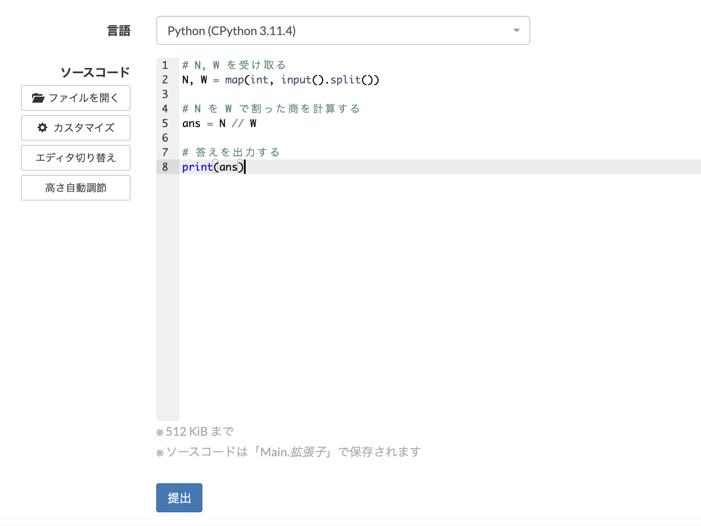
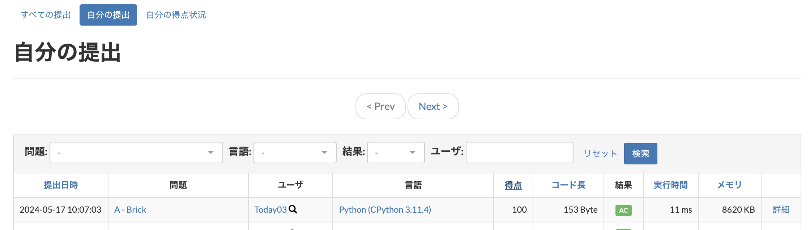
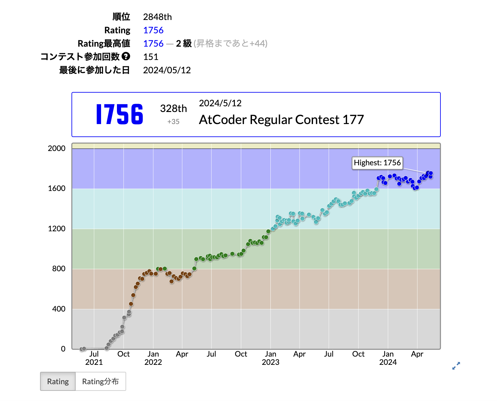

## introduction to atcoder

この記事は、競技プログラミングに入門するための記事です。
ここに書かれていることだけで、競技プログラミングに入門できます。

競技プログラミングは、AtCoder や、Codeforces、ICPC、Google Code Jam など、様々な種類がありますが、敷居が低く、国内で一番普及しているのが AtCoder です。
なので、一番はじめは AtCoder をやってみましょう。


### アカウント作成
AtCoder のアカウントを作成しましょう。
以下のリンクをクリックして、アカウント作成してください。

https://atcoder.jp/register

## 競技プログラミングの問題を解いてみよう

さっそく、競技プログラミングの問題を解いてみましょう。
プログラミングの知識がなくても、とりあえず読んでみてください。
ここでは、文法の説明はしません。あくまで、雰囲気を掴むためのものです。

問題：Brick
https://atcoder.jp/contests/abc186/tasks/abc186_a
```
トラックが 1 台あります。このトラックには合計で N キログラム以下の荷物を乗せることができます。
このトラックに、1 個 W キログラムのレンガを最大でいくつ乗せることができますか？
```

簡単な算数の問題です。
N を W で割った商が答えですね。

早速プログラムを書きましょう。
以下の処理を行えればよいです。

- N と W を標準入力から受け取る
- N を W で割った商を計算する
- 答えを出力する

プログラムは以下のとおりです。
`#` から始まる行は、プログラム上では無視されます。コメントアウトというものです。

```Python
# N, W を受け取る
N, W = map(int, input().split())

# N を W で割った商を計算する
ans = N // W

# 答えを出力する
print(ans)
```

雰囲気はつかめましたか？
コメントを読むと、雰囲気がわかりましたよね？

では、このコードの動作確認をしてください。手元の開発環境で動作確認をするか、AtCoder のコードテストを用いるか、どっちでも構いません。

よさそうなら、実際に提出してみましょう。上記の問題リンクから、ブラウザ下の提出欄にコピペして、言語を選んで提出してください。

遷移先のページで、`AC` が表示されたら成功です！





### プログラミング言語の勉強
プログラミングに触ったことがないよ〜という方向けです。

競プロでよく使われるプログラミング言語として、 C++ と Python があります。次のような特徴の差があるので、自分に合った方を選んでください。
もちろん、他に使いたい言語がある場合はそれを使っても構いません。

| | C++ | Python |
| --- | --- | --- |
| 実行速度 | 速い | 遅い |
| 文法 | 複雑 | 簡単 |
| おすすめ | 競プロを本格的にやりたい人 | とりあえず競プロがどんなものか知ってみたい人 |

使用する言語を決定したらその言語について調べてみましょう。
もちろん、最初から完璧に使いこなせる必要はありません。競プロの問題に取り組みながら、わからないところを少しづつ調べていく、というのが一番効率的です。

AtCoder には C++, Python それぞれの言語の学習資料があるのでぜひ活用してください。

- [C++ の学習資料](https://atcoder.jp/contests/APG4b)
- [Python の学習資料](https://atcoder.jp/contests/APG4bPython)


## コンテストに出場してみよう
AtCoder では、毎週土・日に 21:00 からコンテストが開催されます。
コンテストの成績によって、自分の実力値を表すレートが変動します。



レートに応じて色が付与されるので、上位の色を目指して頑張りましょう！

- [AtCoder 社長のブログ](http://chokudai.hatenablog.com/entry/2019/02/11/155904)
- [業務における期待できる活躍（AtCoder公式）](https://info.atcoder.jp/utilize/jobs/rating-business-impact)
> 400ごとに色がついていて、赤・橙・黄・青・水・緑・茶・灰・黒、という順番になってます。
> 誤解を恐れずに超ざっくりとイメージでの評価をするなら、
> - 灰色は参加すれば誰でもなれるので意欲以外の保証はなし。
> - 学生で茶色なら優秀だがエンジニアとしてはちょっと物足りない。派遣とかで来たエンジニアが茶色あれば一安心。
> - 緑あれば大抵の企業でアルゴリズム力は十分。AtCoder的には決して上位ではないが、他社評価サイトなら最高評価。
> - 水色だと基礎的なアルゴリズム処理能力については疑いのないレベル。
> - 青以上は一部上場のIT企業でも、一人もいないことが結構あるレベルになる。
> - 黄色からは化け物。競プロの問題を解く機械だと思っておけば良い。
> - 橙はあたまおかしい。
> - 赤はもうなんか世界大会とかに招待されたりする。 


## 精進をしよう
競プロの問題を解いて実力をつけることを「精進」と呼びます。競プロの上達のためには、コンテストに出る以外にも精進をすることが大切です。
今からその方法の例をいくつか紹介します。

- AtCoder Problems
  - [AtCoder Problems](https://kenkoooo.com/atcoder#/table/) というサイトで、自身の AtCoder ID を入力すると、ご覧のように解いた問題が緑色に光ります。
  
  
  まずは ABC の A, B 問題から取り組んでみましょう。
  もちろん、解けない問題に出会うこともあると思います。そういったときは解説ページから解説を読んで解法を勉強してみましょう。


- [AtCoder NoviSteps](https://atcoder-novisteps.vercel.app/)
  - 有志が作った、競プロ上達の手助けとなるサイトです。 ABC の問題を中心に細かく難易度分けがされており、自分のレベルに合った過去問に効率的に取り組むことができます。

- 書籍を読む
  - 競プロ関連の書籍もたくさん出版されています。初心者向けから上級者向けまで、幅広いレベルの書籍がありますが、筆者がとくにおすすめしたいのが[「競技プログラミングの鉄則」](https://www.amazon.co.jp/%E7%AB%B6%E6%8A%80%E3%83%97%E3%83%AD%E3%82%B0%E3%83%A9%E3%83%9F%E3%83%B3%E3%82%B0%E3%81%AE%E9%89%84%E5%89%87-%E3%82%A2%E3%83%AB%E3%82%B4%E3%83%AA%E3%82%BA%E3%83%A0%E5%8A%9B%E3%81%A8%E6%80%9D%E8%80%83%E5%8A%9B%E3%82%92%E9%AB%98%E3%82%81%E3%82%8B77%E3%81%AE%E6%8A%80%E8%A1%93-Compass-Books%E3%82%B7%E3%83%AA%E3%83%BC%E3%82%BA-%E7%B1%B3%E7%94%B0/dp/483997750X)です。
  競プロには、コンテスト頻出のアルゴリズムやデータ構造、テクニックなどが数多く存在するのですが、それらが非常にわかりやすくまとめられており、初心者〜中級者には特に勉強になる書籍だと思います。